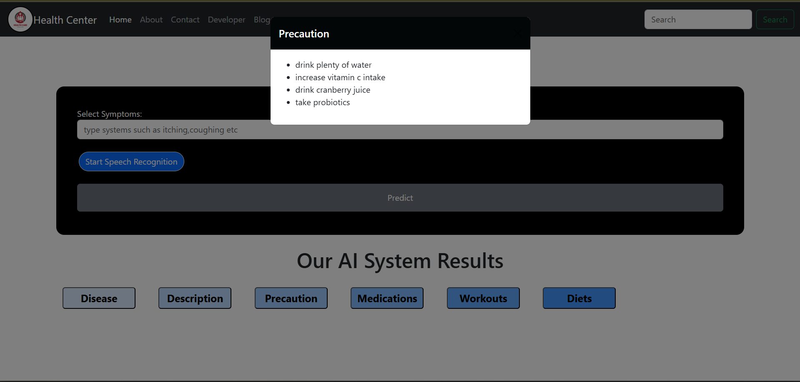

# 🏥 Medicine Recommendation System

An AI-powered web application that predicts diseases based on symptoms and provides helpful information such as description, precautions, medications, workouts, and diets.

---

## 🖥️ Home Page


---

## 🔍 Prediction Result Page


---

## 🚀 Features

- Predicts disease based on entered symptoms  
- Clean UI with Bootstrap design  
- Modal-based display for:  
  - Disease  
  - Description  
  - Precautions  
  - Medications  
  - Workouts  
  - Diets  
- Speech recognition support (voice input)  
- Machine Learning model (SVC) loaded via pickle  

---

## 🛠️ Tech Stack

- **Backend:** Flask (Python)  
- **ML Model:** Support Vector Classifier (SVC)  
- **Frontend:** HTML, CSS, Bootstrap  
- **Speech Recognition:** Web Speech API  
- **Data:** CSV files  

---

## ▶️ How to Run

### 1. Clone the Repository
```bash
git clone https://github.com/doodi687/Medicine.git
cd Medicine

### 2. Create Virtual Environment
```bash
python -m venv .venv


### 3. Activate Virtual Environment
```bash
.venv\Scripts\activate

### 4. Install Requirements
```bash
pip install -r requirements.txt

### 5. Run the Application
```bash
python main.py


### Now visit:
```bash
👉 http://127.0.0.1:5000